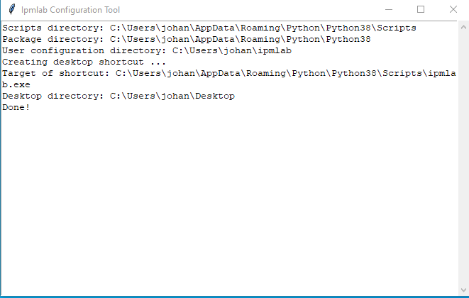
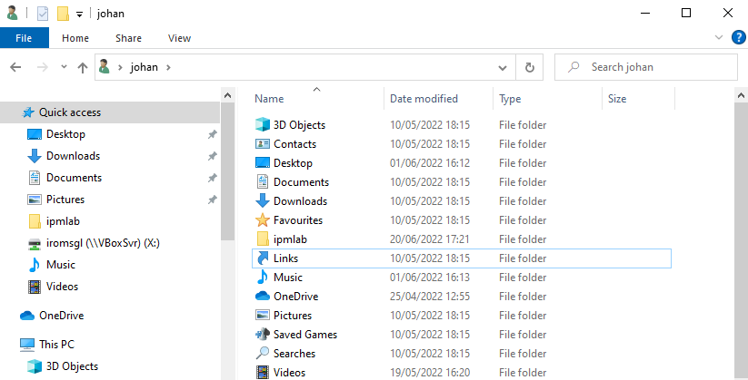
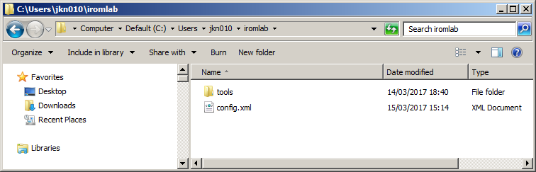

# Ipmlab setup and configuration

## Installation

The recommended way to install Ipmlab is to use *pip*. Installing with *pip* will also automatically install any Python packages that are used by Ipmlab. On Windows systems the *pip* executable is located in the *Scripts* directory which is located under Python's top-level installation folder (e.g. *C:\Python38\Scripts*). To install Ipmlab, follow the steps in either the *Global install* or *User install* subsections below.

### Global install

1. Launch a Command Prompt window. Depending on your system settings you may need to do this with Administrator privilege (right-click on the *Command Prompt* icon and the choose *Run as Administrator*).
2. Type:

      `%path-to-pip%\pip install ipmlab`

    Here, replace %path-to-pip% with the actual file bpath on your system. For example:

     `C:\Python36\Scripts\pip install ipmlab`

### User install

1. Launch a Command Prompt window (no admin rights required)
2. Type:

      `%path-to-pip%\pip install --user ipmlab`

The above steps will install Ipmlab and all required libraries.

## Configuration

Before Ipmlab is ready for use you need to configure it. As a first step, locate the *ipmlab-configure.exe* application. In case of a global install you can find it directly under the *Scripts* directory of the *Python* installation folder:


If you did a user install, it will be somewhere in your Windows user profile (see below). The exact location depends on your local Windows configuration. As an example, in my case it is located in the folder *C:\Users\jkn010\AppData\Roaming\Python\Python38\Scripts*.

Run the configuration application by double-clicking on it. The application will create a configuration directory in your Windows user directory, copy a default configuration file to it, and create a shortcut to the main Ipmlab application on the Windows Desktop [^1]. If all goes well the following window appears:



Click on the *OK* button on the messagebox to close the configuration application:


The automatically generated configuration file needs some further manual editing, which is explained in the sections below.

### If the configuration tool fails

If running the configuration tool doesn't have any effect (i.e. nothing happens, and no window appears, the most likely cause is a bug in the Python pywin32 module that is used by Ipmlab. A workaround can be found [here](https://github.com/KBNLresearch/iromlab/issues/100#issuecomment-594656069). (I ran into this issue myself while trying to do a user install of Iromlab under Windows 10.)

## Finding the configuration file

Locate the Windows User Profile directory[^2]. Open a Command Prompt window and type:

```
set USERPROFILE
```

The output will be something like this:

```
USERPROFILE=C:\Users\jkn010
```

If you open this location on your machine with Window Explorer you will find that it contains a folder named *ipmlab*:   



Open the folder, and you will see this:



## Editing the configuration file

Now open the configuration file *config.xml* in a text editor (e.g. Notepad), or alternatively use a dedicated XML editor. Carefully go through all the variables (which are defined as XML elements), and modify them if necessary. Here is an explanation of all variables.

### driveLetter

This is the logical drive letter that corresponds to the device you want to use for imaging. E.g. for a floppy drive its is typically *A*, in which case the centry in the configuration file looks like this:

```xml
<cdDriveLetter>A</cdDriveLetter>
```

(Note: do *not* add a colon to the drive letter).

### rootDir

This defines the root directory where Ipmlab will write its data. Ipmlab output is organised into *batches*, and each batch is written to *rootDir*. Make sure to pick an existing directory with plenty of space. Example:

```xml
<rootDir>E:\floppyImages</rootDir>
```

### tempDir

This is the directory that is used for writing temporary files. It must be an existing directory; in most cases you can use the default value (*C:\Temp*). Example:

```xml
<tempDir>C:\Temp</tempDir>
```

### prefixBatch

This is a text prefix that is added to the automatically-generated batch names:

```xml
<prefixBatch>kb</prefixBatch>
```

### socketHost

Defines the host address that is used if the socket API is enabled (see below). Use 127.0.0.1 for localhost:

```xml
<socketHost>127.0.0.1</socketHost>
```

### socketPort

Defines the port that is used if the socket API is enabled (see below):

```xml
<socketPort>65432</socketPor
```

### enablePPNLookup

Flag that controls whether PPN lookup is enabled. If set to *True*, the Ipmlab interface contains a widget for entering a *PPN* identifier. After submitting, Ipmlab then performs a lookup on the PPN in the KB catalogue, and automatically extracts the title of the corresponding entry (which is then added to the batch manifest). If set to *False*, the Ipmlab interface contains a widget in which an operator can manually enter a *Title* string; the entered value is written to the batch manifest. In this case no PPN lookup is performed, and the PPN-value in the batch manifest will be a zero-length string.

Allowed values:

```xml
<enablePPNLookup>True</enablePPNLookup>
```

and:

```xml
<enablePPNLookup>False</enablePPNLookup>
```

### enableSocketAPI

This is a flag that -if set to *True*- enables Ipmlab to pick up Title and PPN info from a client application through a socket interface (disabled by default):

```xml
<enableSocketAPI>False</enableSocketAPI>
```

### reportFormatString

Defines the format of the output report that is generated  by IsoBuster. The format is described in the [IsoBuster documentation](https://www.isobuster.com/tips/build_custom_lists_and_reports_via_gui_or_cmd). By default reports are generated in [Digital Forensics XML (DFXML)](http://www.forensicswiki.org/wiki/Category:Digital_Forensics_XML) format. Note that the IsoBuster format string must be wrapped inside a [CDATA section](https://en.wikipedia.org/wiki/CDATA).

### isoBusterExe

Location of isoBuster (installation instructions for Isobuster can be found [here](./setupIsobuster.md)). Example:

```xml
<isoBusterExe>C:\Program Files (x86)\Smart Projects\IsoBuster\IsoBuster.exe</isoBusterExe>
```

If all went well, Ipmlab will now be ready to use!

| |
|:--|
|[Back to Setup Guide](./setupGuide.md)|

[^1]: This will *not* overwrite any pre-existing configuration files.

[^2]: To be more precise: the profile of the user that installed Ipmlab (in case of multiple user profiles)
