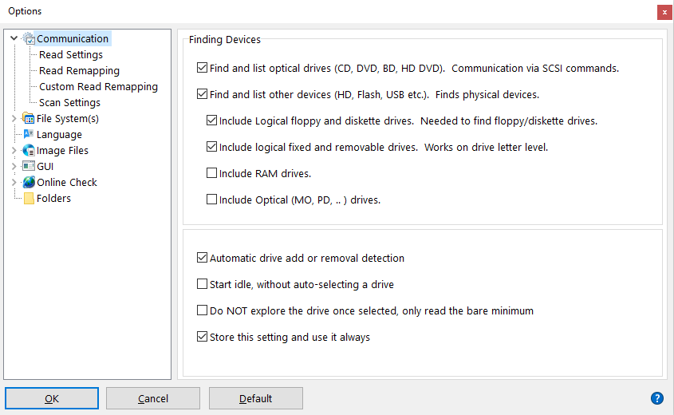
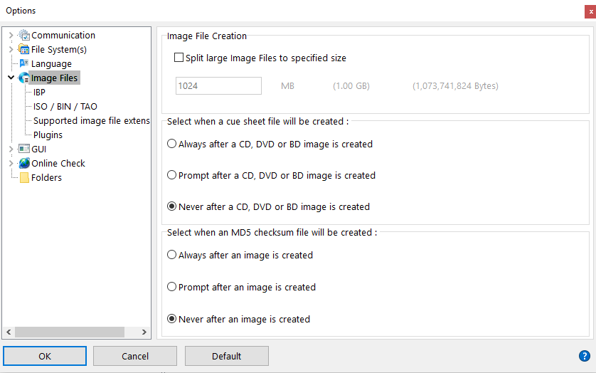
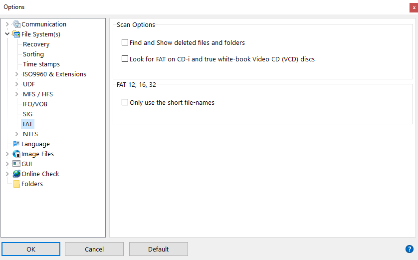

# Isobuster setup and configuration

## Installation

Ipmlab requires Isobuster 5.0 or more recent (older versions may work, but Ipmlab hasn't been tested with it). Go to the Isobuster download page below:

<https://www.isobuster.com/download.php>

Then run the installer (this requires administrator priviliges).

## Registration

When Isobuster is run for the first time, a registration dialog appears. Here you need to enter the appropriate e-mail address, registration ID and license key (which are in the e-mail you received after buying your license).

## Configuration

Before using Ipmlab, it is necessary to change some of IsoBuster's default settings. This is mainly to avoid pop-up dialogs during that need user input during the imaging process. You only need to do this once; the changes will persist after upgrading IsoBuster to a newer version. Below instructions apply to (and were tested with) IsoBuster 5.0 (Professional license).

## Enable removable devices

From the IsoBuster GUI, go to the *Options* menu and then select *Communication*. From there, look at *Finding Devices*, make sure that the following options are checked:

- "Find and list other devices (HD, Flash, USB etc)"
- "Include logical floppy and diskette drives
- "Include logical fixed and removable drives"

Also make sure that the "Store this setting and use it always" checkbox at the bottom of the tab is checked. See screenshot below:

## Disable cue sheet and checksum creation

From the *Options* dialog, select *Image Files*. Locate the option "select when a cue sheet file will be created", and select "Never". Likewise, set the "Select when an MD5 checksum file will be created" setting to "Never". See screenshot:

## Disable find and show deleted files and folders

From the *File System Settings* dialog, go to *FAT*. There, uncheck the "Find and show deleted files and folders"option:

After these changes Isobuster will work correctly when called from Ipmlab.

| | |
|:--|:--|
|[Back to Setup Guide](./setupGuide.md)|[>> Next: dBpoweramp setup and configuration](./setupDbpoweramp.md)|
