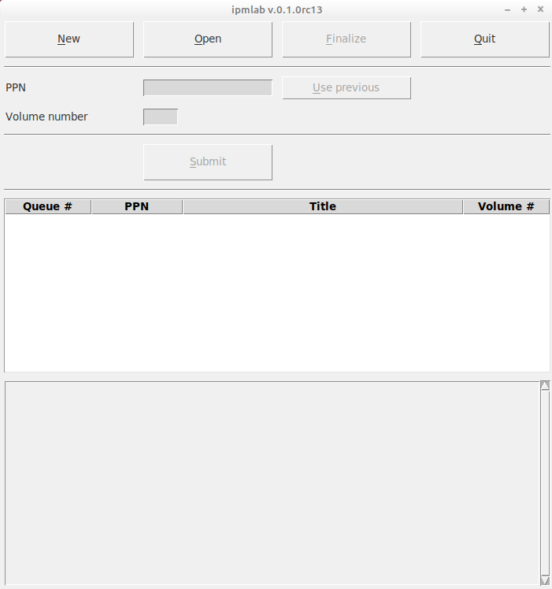
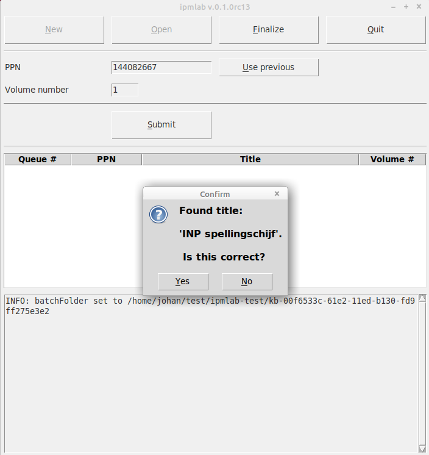
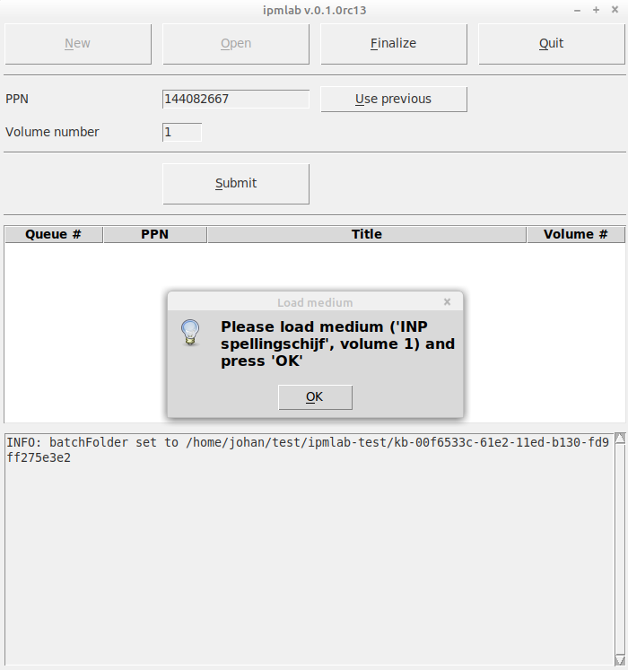
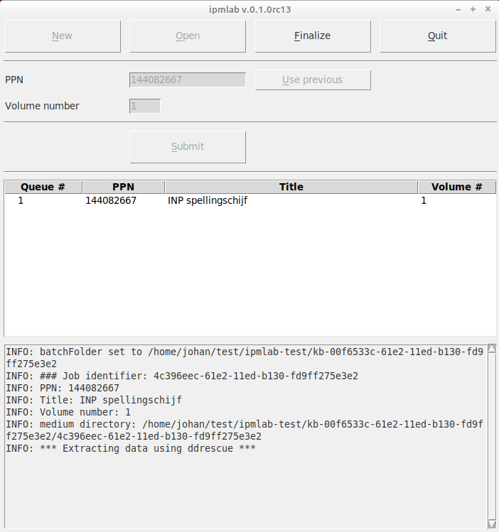
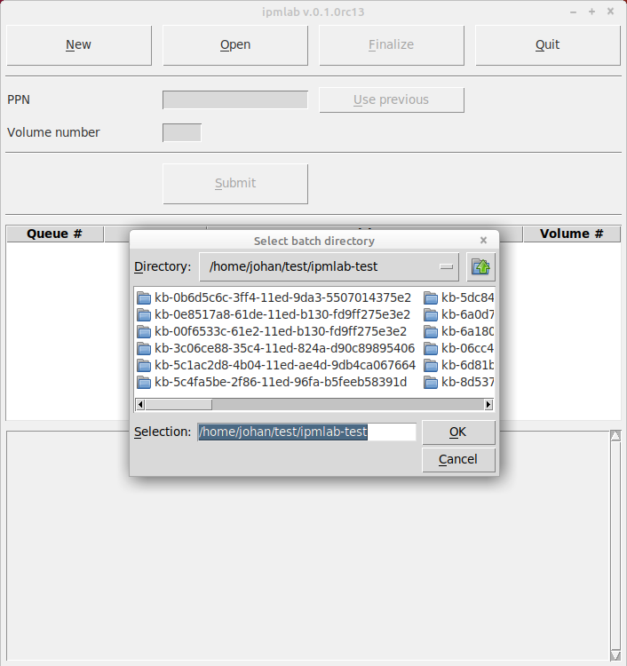
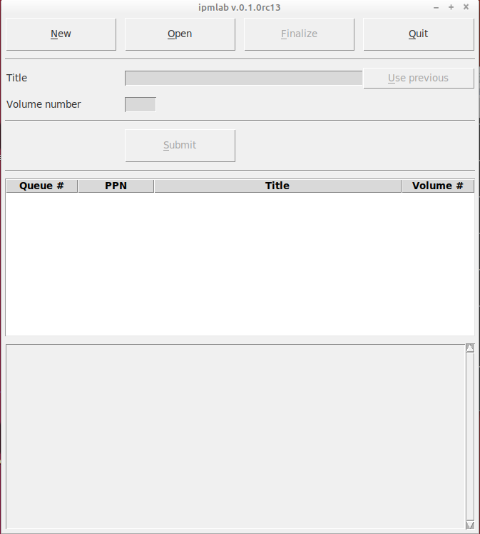

# Ipmlab User Guide

This User Guide assumes that Ipmlab and its dependencies have been installed and configure. If this is not the case, consult the [Setup Guide](./setupGuide.md) first.

---
**Note on write-blocking**

Before you start using Ipmlab, make sure that Windows cannot write to the removable media you want to image! 
For example, Windows 10 automatically [writes a "System Volume Information" folder](https://superuser.com/questions/1199823/how-to-prevent-creation-of-system-volume-information-folder-in-windows-10-for) to any writable storage media
upon insertion (including floppy disks and USB thumb drives). To prevent this from happening, *never* connect these media directly to the computer, but always use a [forensic write blocker](https://en.wikipedia.org/wiki/Forensic_disk_controller) (e.g. [this one](https://security.opentext.com/tableau/hardware/details/t8u) for USB-connected devices).

In addition, for 3.5" floppy disks, ensure the sliding write-protect tab (upper-right corner) is in the open (= protected) position before placing them in the reader.

---

## Getting started

Launch Ipmlab by double-clicking on the Ipmlab Desktop icon. If all goes well the following window appears:



Upon startup, you have three options:

* Create a *New* batch (see below)
* *Open* an existing batch
* *Quit* Ipmlab

## Create a batch

Let's create a new batch. Click on the top-left *New* button. Ipmlab will respond with:


Now press *OK*. The console widget at the bottom of the Ipmlab window now shows the full path to the newly created batch folder.

### Naming of batches

The batch name is automatically generated. It contains of a prefix (defined by the *prefixBatch* variable in Ipmlab's configuration file), followed by a [Universally Unique Identifier](https://en.wikipedia.org/wiki/Universally_unique_identifier), which is based on the hardware address and the current time ("version 1" UUID). This ensures that batch names are always unique if Ipmlab is run on different machines in parallel.

## Process a carrier

Now let's process a carrier (such as a floppy disk or thumb drive). We'll assume here that the *enablePPNLookup* flag in the configuration file is set to *True*: the carrier is part of the KB collection, and has a known PPN identifier associated with it. In this example we'll assume we're using the "INP spellingschijf" 3.5" floppy disk. The catalogue record can of this electronic publication can be found here:

<https://webggc.oclc.org/cbs/DB=2.37/PPN?PPN=144082667>

We start by entering the required fields:


* *PPN* is the PPN that is associated with the carrier (here: *144082667*).
* Leave *Volume number* at the default value of *1* (the assignment of volume numbers and how they are related to carrier type is explained further below).

Now press the *Submit* button. Ipmlab now tries to look up up the entered *PPN* in the catalogue. If a matching record is found it will display the corresponding title, and ask for confirmation:



If the displayed title doesn't match your item (because you accidentally entered the wrong *PPN*), you can press *No*, enter the (correct) *PPN* and then pres *Submit* again. Once the title is as expected, press *Yes*. Another dialog pops up:



Now load the first floppy into the floppy reader. After that, press *OK*. The details (*PPN*, title) of the carrier are added as an entry to the widget in the centre of the *Ipmlab* window:  



Subsequently Ipmlab starts processing the floppy. This involves the following steps:

1. Extract the contents of the medium to an image file using Aaru (Aaru also creates a metadata sidecar files and some other files).
2. Compute SHA-512 checksums for all generated files.
3. Add an entry for the carrier in the *batch manifest* (explained further below).

## Process more carriers

To process additional carriers, simply repeat the steps from the previous section. For multi-volume PPNs you can use the *Use previous* button. After pressing it, you will see the most recently submitted *PPN* in the *PPN* entry widget, and the *Volume number* widget increases the previously entered value by 1.

## Finalize a batch

When you're done entering new carriers, press the *Finalize* button at the top of the Ipmlab window. This will trigger a confirmation dialog:


Then press *Yes*. After a short while another information dialog will pop up telling you that Ipmlab has finished processing this batch. After pressing *OK*, Ipmlab will reset to its initial state. You can now create a new batch, open an existing one, or exit *Ipmlab*.

## Quitting Ipmlab

If you press the *Quit* button, Ipmlab will quit after first finish the processing of the current carrier.

## Opening an existing batch

After pressing the *Open* button upon startup, you will see a file dialog that shows all batch folders in Ipmlab's root directory (*rootDir*):



This allows you to continue a batch that was interrupted with the *Quit* command. 

## enableSocketAPI option

The *enableSocketAPI* option allows one to send *PPN* or *Title* values to the corresponding Ipmlab entry widgets from an external application through a [socket connection](https://en.wikipedia.org/wiki/Network_socket). It can be activated by setting the value of *enableSocketAPI* in the configuration file to *True*:

```xml
<enableSocketAPI>True</enableSocketAPI>
```

When this option is activated, Ipmlab launches a server that listens on a user-defined host address (default: localhost) and port number (default: 65432) combination for incoming requests. This is particularly useful if the *PPN* identifiers or titles are entered from some external database application. In order to communicate with Ipmlab, this application needs to be able to send socket requests. This [Iromlab socket client demo](https://github.com/KBNLresearch/iromlab-socketclient) shows how to do this in Python.

## All carriers of a PPN must be in same batch

Carriers that belong to one particular *PPN* must *always* be in the same batch. This is because the batches are processed into ingest-ready Submission Information Packages (SIPs) further down the processing chain, and all carriers that are part of a *PPN* are grouped into one SIP. This doesn't work if a *PPN* is spread across multiple batches.  

## Processing carriers that are not part of the KB collection

For carriers that are not part of the KB collection, it is recommended to set the *enablePPNLookup* flag in Ipmlab's configuration file to *False*:

```xml
<enablePPNLookup>False</enablePPNLookup>
```

With this setting, the *PPN* widget in the Ipmlab interface is replaced by a *Title* entry widget. You can use it to manually enter a title (or other description) for each carrier:



## The batch manifest

The batch manifest is a comma-delimited text file named *manifest.csv* which is located at the root of a batch. It contains all information that is needed to process the batch into ingest-ready Submission Information Packages further down the processing chain. For each processed carrier, it contains the following fields:

jobID,PPN,volumeNo,title,success,readErrors

1. *jobID* - internal carrier-level identifier. The image file(s) of this carrier are stored in an eponymous directory within the batch.
2. *PPN* - identifier of the physical item in the KB Collection to which this carrier belongs. For the KB case this is the PPN identifier in the KB catalogue. If *enablePPNLookup* is set to *False*, it will be an empty (zero-length) string.
3. *volumeNo* - for intellectual entities that span multiple carriers, this defines the volume number (1 for single-volume items).
4. *title* - text string with the title of the carrier (or the publication it is part of). If *enablePPNLookup* is *True* the title field is extracted from the KB catalogue record. If *enablePPNLookup* is *False* the manually entered *Title* value is used.
windows/win32/api/winioctl/ns-winioctl-get_media_types).
5. *success* - True/False flag that indicates whether the imaging was completed successfully. A *False* value indicates problems.
6. *readErrors* - a True/False flag that indicates whether Aaru encountered read errors.

The first line of the file contains column headers.

Example:

```csv
jobID,PPN,volumeNo,title,success,readErrors
ce5eca7e-f179-11ec-853c-0800272c26ff,144082667,1,INP spellingschijf,True,False
d79c52c1-f179-11ec-9f9f-0800272c26ff,144082667,2,INP spellingschijf,True,False
```

## The log file

Each batch contains a log file *batch.log*. It contains detailed information about the detection and imaging subprocesses. If anything unexpected happens, checking the batch log will help you identify the problem.

## The version file

Each batch contains a file *version.txt*, which holds the Ipmlab version number.

## Created files for each carrier

For each carrier, Ipmlab creates a folder in the batch folder. The name of each folder is (again) a [Universally Unique Identifier](https://en.wikipedia.org/wiki/Universally_unique_identifier), which is based on the hardware address and the current time ("version 1" UUID). Each of these folders contain the following files (with a base name that corresponds to the UUID):

- *xxxxxxxx-xxxx-xxxx-xxxx-xxxxxxxxxxxx.img* - image file (file name follows UUID).
- *xxxxxxxx-xxxx-xxxx-xxxx-xxxxxxxxxxxx.cicm.xml* - Aaru metadata file. Contains various checksums, and filesystem and file-level metadata. 
- *xxxxxxxx-xxxx-xxxx-xxxx-xxxxxxxxxxxx.resume.xml* - Aaru resume mapfile (analogous to ddrescue map file).
- *xxxxxxxx-xxxx-xxxx-xxxx-xxxxxxxxxxxx.log* - Aaru dump log.
- *xxxxxxxx-xxxx-xxxx-xxxx-xxxxxxxxxxxx.error.log* - Aaru error log.
- *xxxxxxxx-xxxx-xxxx-xxxx-xxxxxxxxxxxx.ibg* - undocument Aaru file (this looks like some [ImageBurn-specific format](https://forum.imgburn.com/topic/15561-issues-reating-audio-cd/?do=findComment&comment=121649)).
- Various files ending with a *.bin* file extension - these are written by Aaru (but they are all undocumented, don't know if we should keep them?).
- *meta-kbmdo.xml* - bibliographic metadata from KB catalogue (only if *enablePPNLookup* is enabled).
- *checksums.sha512* - checksum file with SHA-512 hashes of all the above files in this directory.
